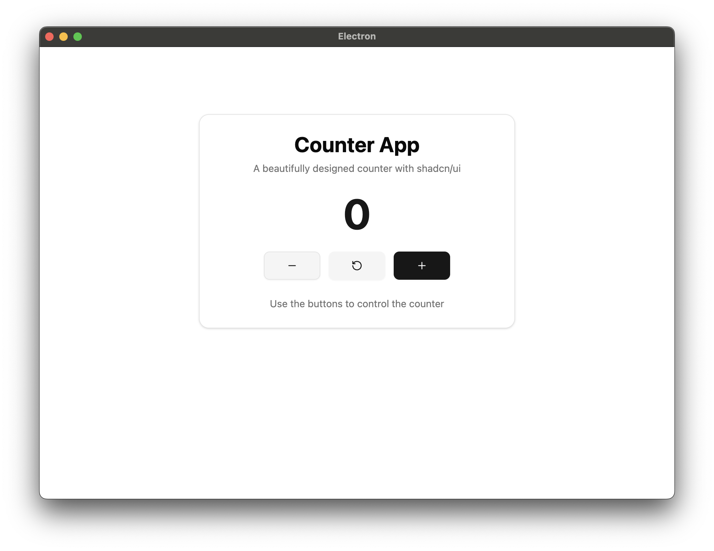

# electron-shadcn-template

This template helps you prototype desktop ideas rapidly. It comes with a pre-wired Electron runtime, a React front-end, integrated state management, and a system-tray workflow—so you can start building features instead of boilerplate.



## ✨ Features

- ⚡️ **Vite** – instant HMR & lightning-fast builds
- 🖥 **Electron 35** – cross-platform desktop runtime
- 💅 **shadcn/ui + TailwindCSS** – beautiful components out of the box
- 📦 **electron-builder** – one-command packaging for macOS, Windows & Linux
- 🗄 **Zustand** – minimal, hooks-based global store (`src/renderer/store`)
- 🍳 **System Tray** – minimise, restore and quit directly from the tray icon

## 🚀 Getting Started

```bash
# clone & install
git clone <repo-url>
cd electron-shadcn-template
npm install

# run in development mode with live reload
npm run dev
```

The counter window opens automatically; if you close it, the app stays alive in the tray. Re-open it or quit from the tray menu.

Need more shadcn/UI components? Add it in seconds:

```bash
npx shadcn@latest add <component-name>
```

Browse the full catalog at [ui.shadcn.com](https://ui.shadcn.com/).

## 📜 Scripts

| Command                       | Description                                   |
| ----------------------------- | --------------------------------------------- |
| `npm run dev`                 | Start the app in development mode             |
| `npm run build`               | Production build (all processes)              |
| `npm run build:mac`           | Package the app for macOS                     |
| `npm run build:win`           | Package the app for Windows                   |
| `npm run build:linux`         | Package the app for Linux                     |
| `npm run build:unpack`        | Build and create an unpacked directory        |

## 📂 Project Structure

**Folder overview**

- `src/main/` – Electron **main process** (backend / business logic, tray, updates, IPC)
- `src/preload/` – Secure **context-bridge** exposing whitelisted APIs to the renderer
- `src/renderer/` – **React front-end** (TailwindCSS, shadcn/ui, Zustand live only here)
  - `components/` – Re-usable UI components
  - `store/` – Client-side Zustand stores
  - `windows/` – Individual windows / pages (e.g. Counter)

## 🛠 Recommended IDE Setup

- VS Code
  - Tailwind CSS IntelliSense (optional)
  - Icons/Theme of your choice

## 📄 License

[MIT](LICENSE)
